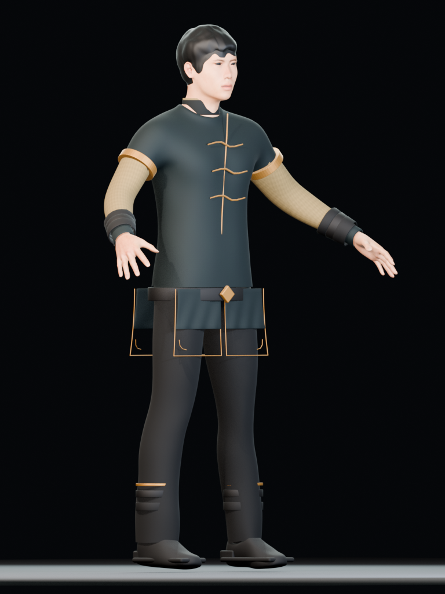
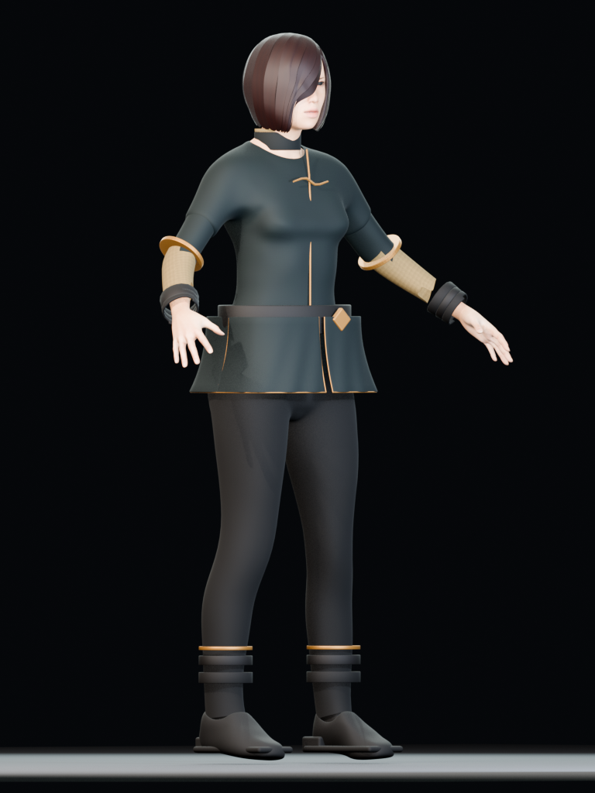
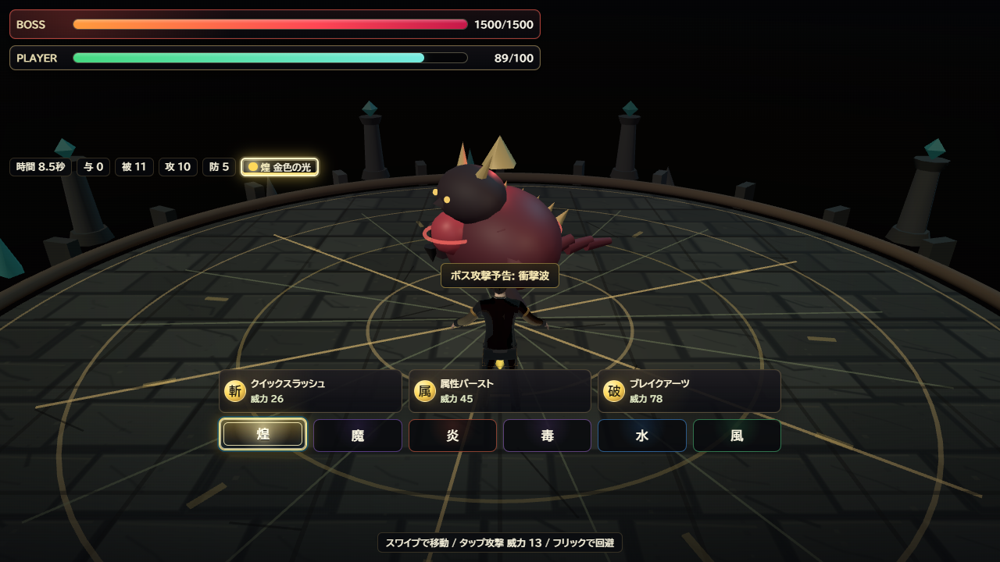

# キャラクター3Dモデル v6 制作記録

v6 は、v4 の参照画像投影と v5 のハイブリッド再構成を破棄し、人体、顔、手、髪、衣装、靴をすべて実メッシュで構成し直した系列です。ターンアラウンド画像は形状と衣装の参照にだけ使い、モデル表面への画像投影には使っていません。

最終採用版は **v6.20** です。男性・女性ともに MPFB のゲーム向け人体トポロジーと53ボーンリグを保持し、UV付きPBR素材、埋め込みテクスチャ、1頂点最大4ジョイントでGLB化しています。

## 最終成果物

| 種別 | 男性 | 女性 |
| --- | --- | --- |
| ゲーム読込GLB | `public/models/characters/initial-male-v6.glb` | `public/models/characters/initial-female-v6.glb` |
| Blender編集元 | `art-source/characters/initial-male-v6.blend` | `art-source/characters/initial-female-v6.blend` |
| 四方向画像 | `character-concepts/model-history/v6.20/initial-male-v6-*.png` | `character-concepts/model-history/v6.20/initial-female-v6-*.png` |
| GLB再読込証拠 | `character-concepts/model-history/v6.20/glb-proof/initial-male-v6-glb-proof.png` | `character-concepts/model-history/v6.20/glb-proof/initial-female-v6-glb-proof.png` |

### 男性 v6.20




### 女性 v6.20




## v6.0〜v6.20 制作過程

各版の画像と機械可読メタデータは `docs/character-concepts/model-history/` 以下へ版別保存しています。「不採用」は生成に失敗したという意味ではなく、実画像またはGLB再読込検査で品質上の問題を確認し、完成版から除外した版です。

却下版の `.blend` / `.glb` は最終成果物と重複する大容量の派生データなのでGitへは含めず、再生成スクリプト、版別画像、メタデータを履歴として残します。編集可能な最終 `.blend` とゲーム読込用GLBは上記の最終成果物へ含めています。

| 版 | 判定 | 実施内容と次版へ残した課題 |
| --- | --- | --- |
| [v6.0](character-concepts/model-history/v6.0-hair-audition/) | 選定 | 男女の複数髪型を正面・側面・背面で比較。男性 `short02`、女性 `bob02` を選定。 |
| [v6.1](character-concepts/model-history/v6.1-clothing-audition/) | 選定 | 衣装・袖・靴を比較。男性 `casualsuit02`、女性 `casualsuit01`、女性長袖 `elegantsuit01`、共通 `shoes02` を選定。 |
| [v6.2](character-concepts/model-history/v6.2/) | 不採用 | 実メッシュ版の初回。二重肩の鋸歯、針状髪、浮いた前合わせを検出。 |
| [v6.3](character-concepts/model-history/v6.3/) | 不採用 | 針状髪と大きな前合わせ浮きを修正。男性上袖の境界と靴底が未完成。 |
| [v6.4](character-concepts/model-history/v6.4/) | 不採用 | 女性全身を追加。男性は半袖と麻袖の間に肌が露出し、女性は前髪と追加上袖が粗い。 |
| [v6.5](character-concepts/model-history/v6.5/) | 不採用 | 男性の追加上袖を廃止。女性の前髪変形が側頭部を翼状に割ったため再設計。 |
| [v6.6](character-concepts/model-history/v6.6/) | 不採用 | 女性前髪の広範囲変形を撤回。目周りの開口輪郭と肩境界が残る。 |
| [v6.7](character-concepts/model-history/v6.7/) | 不採用 | 長袖トポロジー抽出を検証。男性用袖を女性へ流用したことで肩が盛り上がった。 |
| [v6.8](character-concepts/model-history/v6.8/) | 不採用 | 女性専用長袖で肩を改善。袖切替バンドが腕から浮いた。 |
| [v6.9](character-concepts/model-history/v6.9/) | 不採用 | 男女別袖と密着バンドを採用。男性の背面二重肩、襟、腰パネルが未合格。 |
| [v6.10](character-concepts/model-history/v6.10/) | 不採用 | 二重袖を廃止し、連続衣装を材質分割。512pxの布・麻・革・髪PBR素材を埋め込み。男性の袖境界と襟、女性長袖の欠落が課題。 |
| [v6.11](character-concepts/model-history/v6.11/) | 不採用 | 女性長袖を復元し、一体型立ち襟へ変更。襟の採寸が肩を含み、首から浮いた。 |
| [v6.12](character-concepts/model-history/v6.12/) | 不採用 | 首実寸へ再採寸し袖切替を被覆。襟前側の奥行き不足を検出。 |
| [v6.13](character-concepts/model-history/v6.13/) | 不採用 | 四方向外観は通過。GLB再読込で編集用ボーン表示 `Icosphere` の混入を検出。 |
| [v6.14](character-concepts/model-history/v6.14/) | 不採用 | 編集用ヘルパーを除外。glTFの4ジョイント上限による顔・手・肩の変形差を検出。 |
| [v6.15](character-concepts/model-history/v6.15/) | 不採用 | Aポーズをバインド姿勢へ焼き、全頂点を最大4ジョイントへ正規化。皮膚Alphaと女性二重袖がGLB証拠画像で不合格。 |
| [v6.16](character-concepts/model-history/v6.16/) | 不採用 | 眉・睫毛以外の皮膚を不透明化し、顔内部や手内部の透けを解消。女性胸部の衣装下に皮膚の点状露出が残る。 |
| [v6.17](character-concepts/model-history/v6.17/) | 不採用 | 女性衣装を法線方向へオフセット。点状露出を完全には除去できず、方式を変更。 |
| [v6.18](character-concepts/model-history/v6.18/) | 不採用 | 衣服内へ完全に隠れる体表面を削除し、ポーズ時の貫通とオーバードローを低減。裾パネルとプレビュー枠を再監査。 |
| [v6.19](character-concepts/model-history/v6.19/) | 不採用 | 女性裾の側面シームを閉じ、前後深度を調整。内側パンツとのクリアランスが不足。 |
| [v6.20](character-concepts/model-history/v6.20/) | **採用** | 裾幅・深度・フレアと衣装内クリアランスを確定。隠れた体表面を整理し、四方向、GLB新規再読込、ゲーム実機表示を通過。 |

## v6.20 GLB受入検査

検査は元の `.blend` ではなく、空のBlenderシーンへ最終GLBを新規インポートして行いました。詳細値は [`glb-validation.json`](character-concepts/model-history/v6.20/glb-validation.json) に保存しています。

| 項目 | 男性 | 女性 |
| --- | ---: | ---: |
| GLBサイズ | 13,484,968 bytes | 13,821,916 bytes |
| インポート後メッシュ | 52 | 47 |
| インポート後頂点 | 96,304 | 96,096 |
| インポート後三角形 | 143,272 | 141,942 |
| マテリアル | 15 | 15 |
| 埋め込み画像 | 13 | 13 |
| 外部画像依存 | 0 | 0 |
| アーマチュア | 1 | 1 |
| ボーン | 53 | 53 |
| 1頂点の最大ジョイント | 4 | 4 |
| UV付きメッシュ | 52 | 47 |


## ゲーム統合

`src/three/createBattleScene.ts` は `GLTFLoader` で男性 v6 GLBを直接読み込み、GLB内のPBRマテリアルを保持します。テクスチャには最大8のanisotropyを設定し、モデルを地面へ合わせ、カメラ側とボス側の両方から局所照明を当てています。

既存FBXアニメーションはMixamo系ボーン名で、v6のMPFBリグとは一致しません。共通の `Root` だけを誤って結びモデル全体を移動させないよう、v6リグではFBXをバインドせず、移動・回避・攻撃時の小さな合成モーションだけを適用しています。正式なリターゲット済みクリップは今後追加できる構造です。

### PC表示



### 375 × 812 表示


## 再生成と再検査

Blender 5.2 と MPFB が有効な通常プロファイルから実行します。

```powershell
& "C:\Program Files\Blender Foundation\Blender 5.2\blender.exe" `
  --background --python scripts\build_clean_characters_v6.py -- `
  --character all --revision v6.20
```

最終GLBを独立再読込して検査・証拠レンダーを更新します。

```powershell
& "C:\Program Files\Blender Foundation\Blender 5.2\blender.exe" `
  --background --python scripts\validate_clean_character_glb.py -- `
  --male public\models\characters\initial-male-v6.glb `
  --female public\models\characters\initial-female-v6.glb `
  --output docs\character-concepts\model-history\v6.20\glb-validation.json `
  --render-dir docs\character-concepts\model-history\v6.20\glb-proof
```
