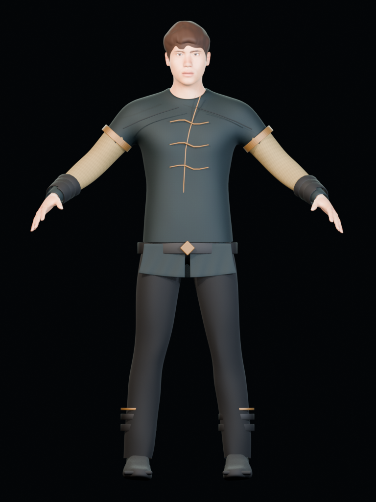
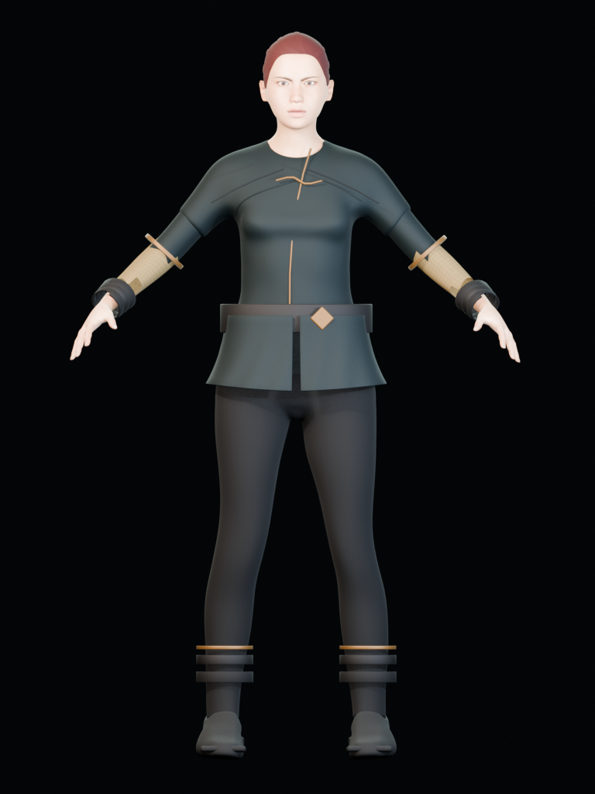
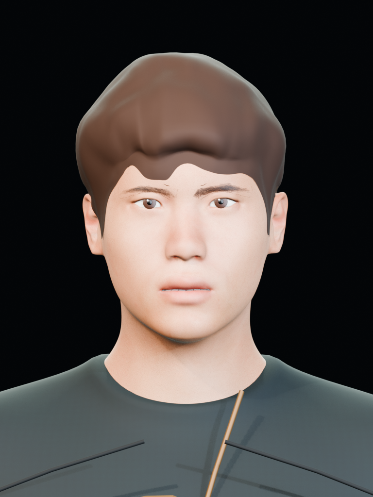
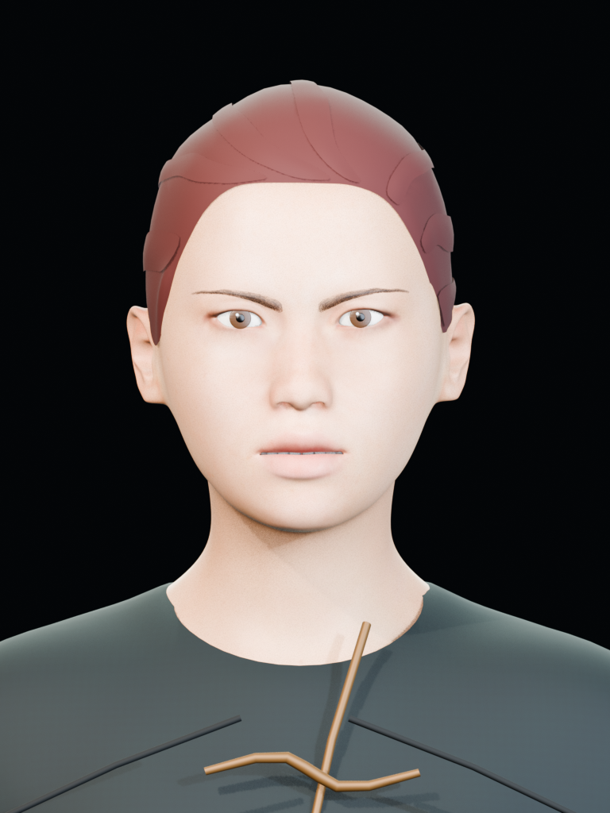
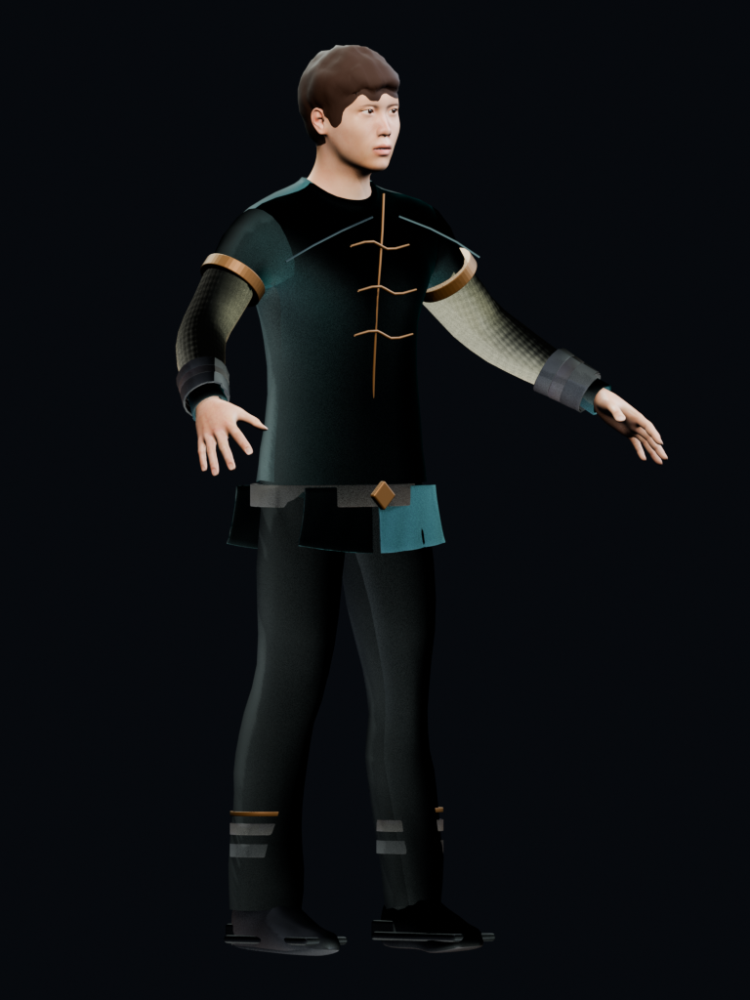
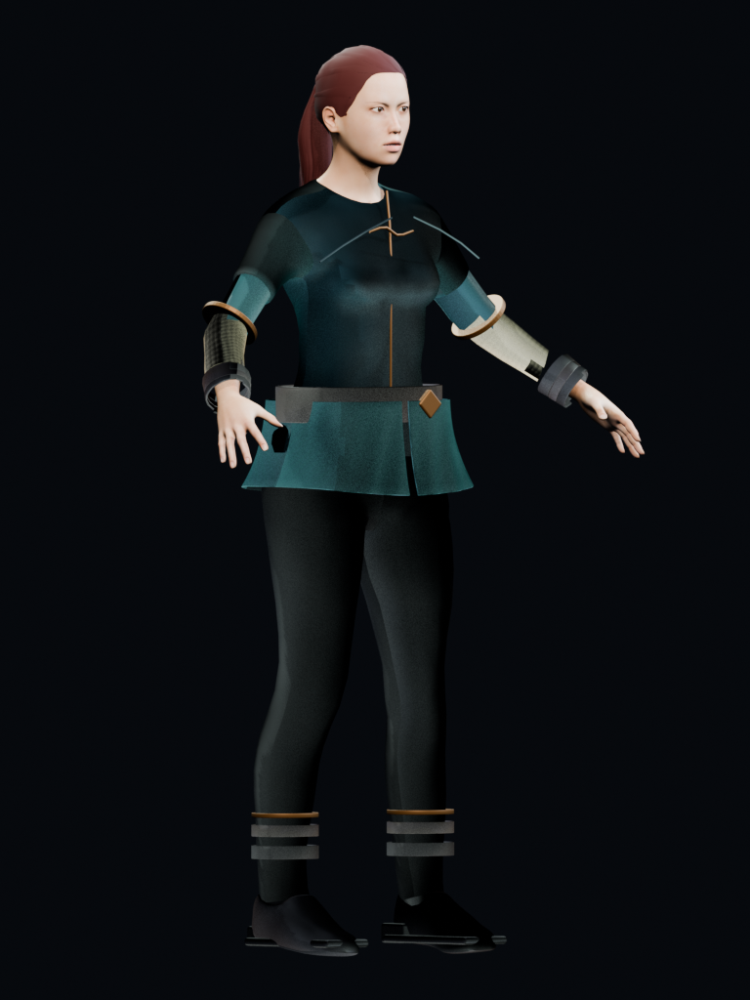
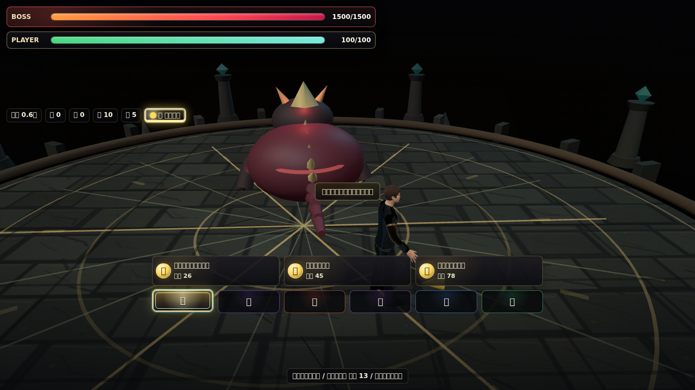
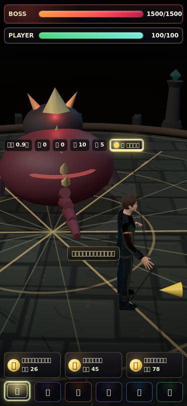

# v7 キャラクターモデル制作記録

## 合格基準

v7では「市販ゲームの実プレイ画面に登場しても、未完成・画像投影・破綻モデルに見えないこと」を合格基準とした。正面画像だけでは採用せず、次をすべて必須とした。

- 顔・髪・手・衣装・脚・靴が実メッシュで、ターンアラウンド画像を面へ投影しない
- 正面、斜め、右側面、背面、顔近接、衣装近接で浮遊片・欠け・交差がない
- GLBを空のBlenderへ読み直し、保存元と材質・輪郭が一致する
- 53骨、1頂点最大4ウェイト、UV、外部画像参照0を満たす
- `Idle`、`Run`、`Attack`、`Dodge`をGLBへ内包する
- PC 1280×720とモバイル375×812のゲーム画面で読み込み、入力後も例外がない

## 全反復

| 版 | 判定 | 確認結果 |
| --- | --- | --- |
| v7.0 | 不採用 | 広い造形毛束を試したが、針状・房状の髪に見えた。目と衣装もまだ試作段階。 |
| v7.1 | 不採用 | short03へ変更。片目を覆い、髪色と顔の統一感も不足。 |
| v7.2 | 不採用 | Hunyuan生成形状とのハイブリッドを検証。手の重複、首と材質境界の鋸歯状破綻を確認。 |
| v7.3 | 不採用 | short01と立体虹彩・瞳孔・キャッチライトを追加。髪が帽子状に見えた。 |
| v7.4 | 不採用 | 衣装構造を追加したが、内襟が大きすぎて首周りを圧迫。 |
| v7.5 | 不採用 | 襟を縮小。男性は候補になったが、女性ボブが片目を完全に隠した。 |
| v7.6 | 不採用 | 前髪を切る処理を試したが、顔面の穴と腕の欠落を発生させた。 |
| v7.7 | 候補 | 女性をポニーテールへ変更し袖を復元。両目と全身シルエットを回復。 |
| v7.8 | 不採用 | 男女統合候補。4動作を内包したが、男性額の黒点、眼球外側の黒潰れ、襟の首交差を近接画像で検出。 |
| v7.9 | 不採用 | 透過眉・まつ毛と襟部品を除去。新しい立体眉が短すぎ、女性の別ボブも片目を隠した。 |
| v7.10 | 不採用 | 不透明髪と元の眉へ復帰。黒い眼球外縁が残った。 |
| v7.11 | 不採用 | 不透明スクレラで眼球欠けを解消。空シーン再読込で女性髪に横縞が出る材質変換差を検出。 |
| v7.12 | 不採用 | 毛流れ画像を不透明色として使用。男性前髪下に帯状の塗りが生じた。 |
| v7.13 | 不採用 | 毛髪アルファを0.62でクリップ。男性額の黒点とギザギザの髪際が再発。 |
| **v7.14** | **採用** | 単純な不透明PBR髪へ固定。6方向、GLB再読込、4動作、PC/375pxゲーム表示を通過。 |

各版の実レンダーは[制作履歴ディレクトリ](character-concepts/model-history/README.md)に保存している。失敗版を含むPNGとメタデータは残し、巨大な中間Blend/GLBは最終採用品だけをGit管理する。

## v7.14 採用品

| 項目 | 男性 | 女性 |
| --- | ---: | ---: |
| ソース頂点 | 24,780 | 26,966 |
| ソース三角形 | 45,886 | 48,284 |
| メッシュ | 44 | 43 |
| 骨 | 53 | 53 |
| 最大ウェイト数 | 4 | 4 |
| 埋込動作 | Idle / Run / Attack / Dodge | Idle / Run / Attack / Dodge |
| 画像投影 | なし | なし |

最終ソース:

- `art-source/characters/initial-male-v7.blend`
- `art-source/characters/initial-female-v7.blend`
- `public/models/characters/initial-male-v7.glb`
- `public/models/characters/initial-female-v7.glb`

## 検証証拠

- [GLB再読込結果](character-concepts/model-history/v7.14/glb-validation.json)
- [ブラウザ検証結果](character-concepts/model-history/v7.14/browser-validation.json)

## 判定の扱い

v6.20はリグ・GLB・ゲーム統合の技術確認版であり、外観完成版ではなかった。v7.14を外観を含む最初の採用版とし、今後も元Blendの見た目だけでなく、GLB再読込と実ゲーム画面を同時に合格条件とする。
